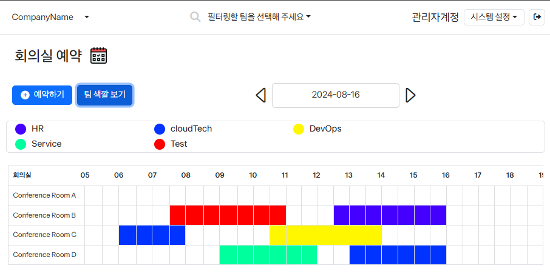
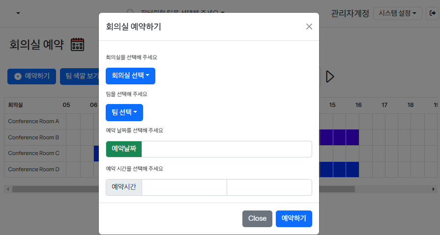
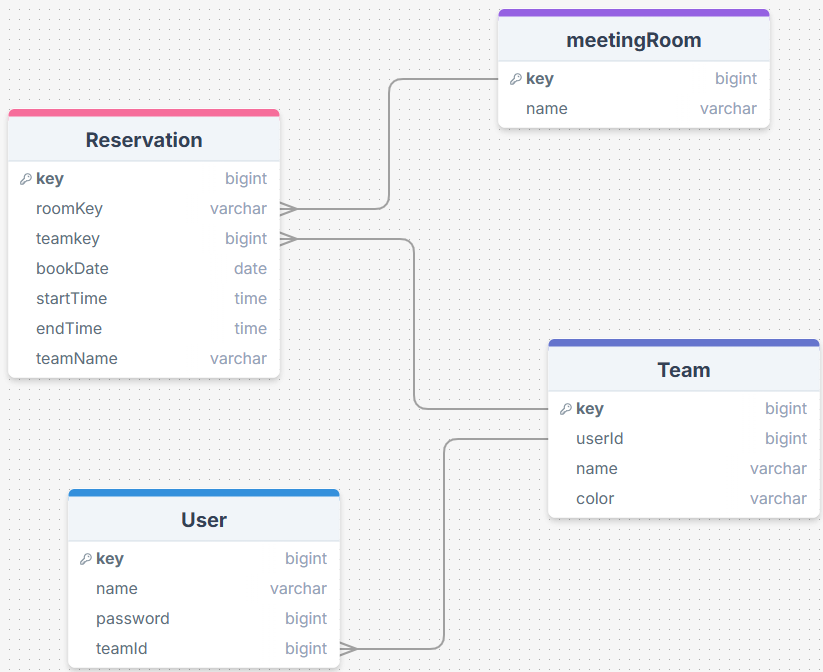
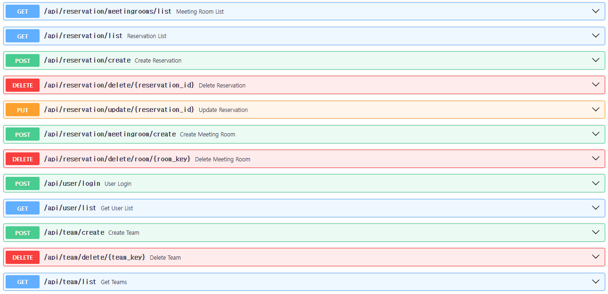

# 회의실 예약 서비스

개발 기간 : 2024-08-05 ~ 2024.08.16

#### 프로젝트 소개

회의실예약 현황 한눈에 알아보고 간편하게 예약까지 하는 서비스

-   간트차트 형식으로, 한눈에 어떤 팀이 어느 시간대에 회의실을 예약했는지 알 수 있다.
-   Drag & Selection 기능으로, 손쉽게 특정 시간대, 특정 회의실을 예약할 수 있다.

## 화면구성





## Backend

프레임워크 - FastAPI
언어 - Python

#### ERD



#### API



## FE

#### 기술스택

-   HTML, CSS, JavaScript(jQUery)
-   CSS : Bootstrap, fontawesome, jquery UI
-   Util : Bootstrap datetimepicker

## 기능소개

### 예약

1. 현재 날짜를 기준으로, 예약된 목록들을 가져와 화면에 표시한다.
2. 예약을 삭제, 수정한다. (같은 팀인 경우)
3. 예약을 생성한다.
4. 예약이 이미 차있는 경우, 오류메시지

### 로그인

단순히, BE내에서 admin을 판단 후, 맞다면 response로 true를 반환

Admin 여부에 따라 기능이 달라진다.

**Admin**

-   팀 삭제, 추가 기능
-   회의실 삭제, 추가 기능
-   예약 생성 및 삭제, 수정

**일반**

-   예약 생성
-   예약 삭제, 수정 (본인 팀)

### 필터링

-   원하는 팀을 선택하면, 그 팀이 예약한 목록이 나타난다.

## 실행방법 (How to Run)

Backend

```cmd
git clone [thisRepository]
cd reservationSite/BE/reserveapi

REM This is Optional (Make Virtual environment)

    python -m venv venv

    REM Windows
    .\venv\Scripts\activate

    REM Mac/Linux
    source venv/bin/activate

pip install fastapi uvicorn sqlalchemy alembic

alembic upgrade head

uvicorn main:app --reload --port 8011
REM Note: Please refer to the baseurl in FE's api.js for the port. The current project's baseurl is set to 8011.
```

Frontend

A simple `index.html` file served via live server.

Use a live server extension (such as the VSCode Live Server extension) to serve index.html.

The frontend will be served on localhost with the default port provided by the live server.
